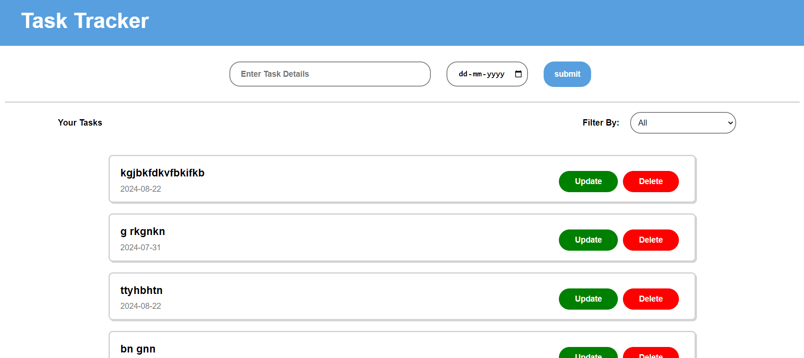

# Task Tracker

Task Tracker is a simple web application that helps you manage and track your tasks efficiently. It is built using HTML, CSS, and JavaScript.

## Features

- Add new tasks
- Update tasks
- Delete tasks
- Responsive design

